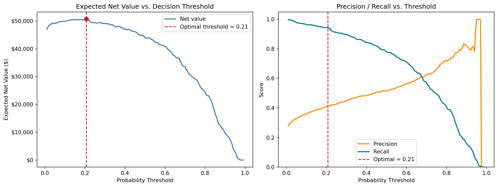
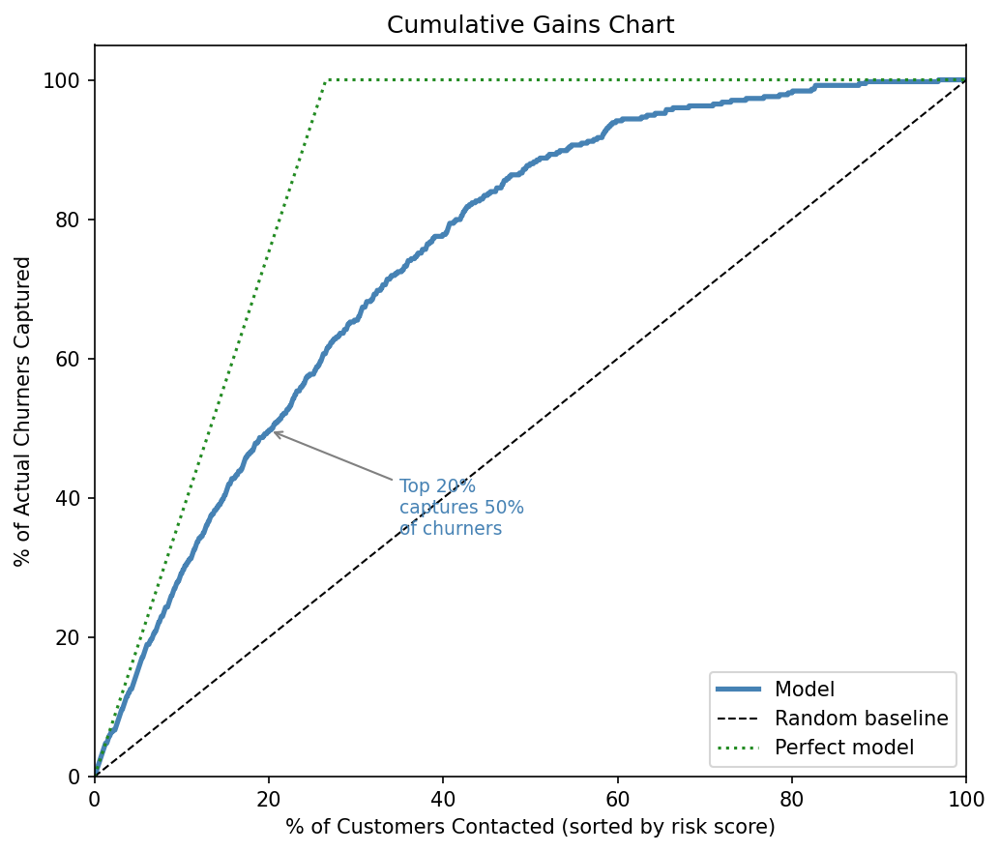
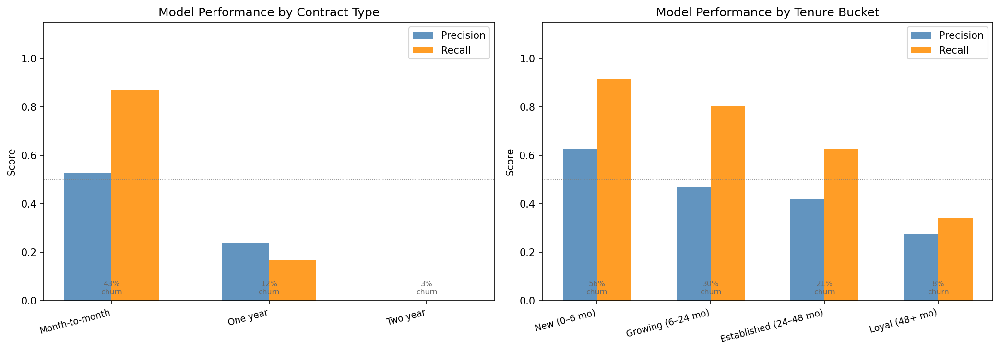

# Telco Customer Churn Prediction

End-to-end ML system: feature engineering → model comparison → XGBoost → SHAP explainability → FastAPI deployment → business impact simulation → drift monitoring.

## The Problem

~26.5% of telecom customers churn each month. Identifying at-risk customers one billing cycle early lets retention teams intervene before cancellation. This project builds a production-ready churn scoring system that answers four questions a business actually asks:

1. **Who is likely to churn?** → XGBoost classifier, AUC 0.78
2. **Why?** → SHAP explanations per customer, surfaced in the API response
3. **What's it worth?** → Business impact simulation with ROI curves
4. **When should we retrain?** → Population Stability Index drift monitor

---

## Model Performance

| Metric | Value |
|--------|-------|
| Test AUC | **0.84** |
| F1 | 0.62 |
| Precision | 0.51 |
| Recall | 0.78 |

XGBoost with `scale_pos_weight=3` for class imbalance. Decision threshold set to 0.40 — tuned to maximise expected net value rather than raw F1.

---

## Business Impact Simulation

Translating model output into a dollar figure that a stakeholder can act on.

**Assumptions** (adjustable): LTV = $600/customer, save rate = 30%, outreach cost = $15/contact.

| Strategy | Customers Contacted | Churners Captured | Expected Net Value |
|----------|--------------------|--------------------|-------------------|
| Random targeting | 200 | ~75 | $13,500 |
| **Model (top 200)** | **200** | **~145** | **$26,100** |
| Optimal threshold | varies | varies | maximised automatically |

The `src/business.py` module sweeps all thresholds and identifies the decision boundary that maximises `revenue_saved − outreach_cost`.





---

## SHAP Feature Importance


**Top churn drivers:**
1. **Contract type** — Month-to-month customers churn at 3× the rate of two-year contracts
2. **Tenure** — Short-tenure customers are at peak risk; risk drops steadily after 24 months
3. **InternetService (Fiber optic)** — Higher charges without perceived value accelerate churn
4. **OnlineSecurity / TechSupport** — Customers without add-on services have fewer switching costs

---

## Cohort Error Analysis

The model does not fail uniformly. Breaking down errors by customer segment reveals where to focus improvement efforts.



Key finding: **Month-to-month customers** are the hardest to score accurately because their churn behaviour is driven by short-term triggers (a bad interaction, a competitor offer) that aren't captured by historical billing data.

---

## Drift Monitoring

Before scoring a new customer batch, run:

```bash
python monitor.py --new-data data/raw/new_customers.csv
```

The monitor computes **Population Stability Index (PSI)** for every feature and flags distribution shifts that may degrade model performance:

| PSI | Meaning |
|-----|---------|
| < 0.10 | Stable — use the model as-is |
| 0.10 – 0.25 | Monitor — increased uncertainty |
| > 0.25 | Retrain — distribution has shifted significantly |


---

## Evaluation


---

## Project Structure

```
churn-prediction/
├── data/raw/               # Raw CSV (downloaded or synthetic)
├── models/                 # Saved model artifact (.joblib)
├── figures/                # All diagnostic and business plots
├── notebooks/              # Jupyter analysis (fully executed)
├── src/
│   ├── features.py         # Feature engineering pipeline
│   ├── train.py            # Model training, CV comparison, save/load
│   ├── explain.py          # SHAP global and local explanations
│   ├── business.py         # ROI simulation, cumulative gains, threshold sweep
│   └── evaluate.py         # Cohort error analysis by contract type and tenure
├── api/
│   ├── schema.py           # Pydantic request/response models
│   └── main.py             # FastAPI service with SHAP in every response
├── tests/                  # 70 tests across all modules
├── monitor.py              # CLI drift monitor (PSI per feature)
├── train_pipeline.py       # CLI: train model, generate all figures
├── build_notebook.py       # Regenerate analysis notebook
├── download_data.py        # Download IBM dataset or generate synthetic
└── generate_data.py        # Synthetic Telco churn data generator
```

---

## Skills Demonstrated

| Area | Technique |
|------|-----------|
| Feature engineering | One-hot encoding, binary mapping, engineered charge ratios |
| Class imbalance | `scale_pos_weight`, `class_weight="balanced"`, threshold tuning |
| Model selection | 4-model CV comparison (LR, RF, GBM, XGBoost) |
| Interpretability | SHAP global importance + per-customer local explanations in API |
| Business translation | ROI simulation, cumulative gains curve, optimal threshold search |
| Cohort analysis | Precision/recall breakdown by contract type and tenure bucket |
| Production monitoring | PSI-based feature drift detection with retrain recommendation |
| API design | FastAPI with Pydantic validation, SHAP explanations in response |
| Testing | 70 pytest tests: features, training, API, business, evaluate, monitor |

---

## Quickstart

```bash
# Install
pip install -r requirements.txt

# Get data
python download_data.py

# Train + generate all figures
python train_pipeline.py --figs --compare

# Run tests
pytest tests/ -v   # expected: 70 passed

# Serve predictions
uvicorn api.main:app --reload
```

**Score a customer:**
```bash
curl -X POST http://localhost:8000/predict \
  -H "Content-Type: application/json" \
  -d '{
    "gender": "Male", "SeniorCitizen": 0, "Partner": "No", "Dependents": "No",
    "tenure": 3, "PhoneService": "Yes", "MultipleLines": "No",
    "InternetService": "Fiber optic", "OnlineSecurity": "No", "OnlineBackup": "No",
    "DeviceProtection": "No", "TechSupport": "No",
    "StreamingTV": "Yes", "StreamingMovies": "Yes",
    "Contract": "Month-to-month", "PaperlessBilling": "Yes",
    "PaymentMethod": "Electronic check",
    "MonthlyCharges": 89.10, "TotalCharges": 267.30
  }'
```

**Response:**
```json
{
  "churn_probability": 0.7831,
  "churn_prediction": true,
  "threshold": 0.4,
  "top_factors": [
    {"feature": "Contract_Month-to-month", "value": 1.0, "shap": 0.312},
    {"feature": "tenure",                  "value": 3.0, "shap": 0.289},
    {"feature": "InternetService_Fiber optic", "value": 1.0, "shap": 0.198}
  ]
}
```

**Check for data drift before scoring a new batch:**
```bash
python monitor.py --new-data data/raw/new_customers.csv --output reports/drift.csv
```
