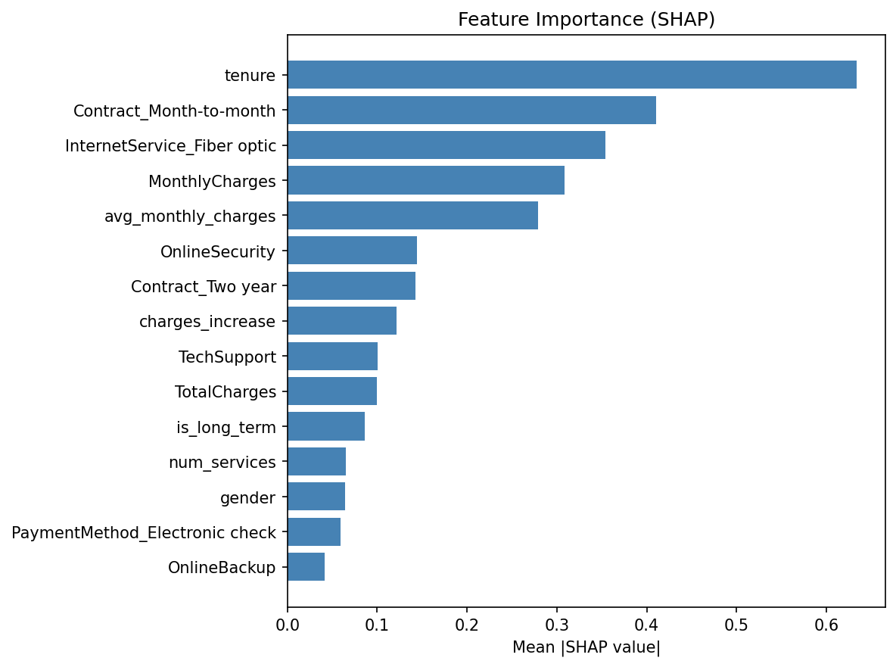

# Telco Customer Churn Prediction

End-to-end ML system: feature engineering → model comparison → XGBoost → FastAPI deployment with SHAP explanations.

## Problem

~26.5% of telecom customers churn each month. Identifying at-risk customers one billing cycle early lets retention teams intervene before the cancellation. This project builds a production-ready churn scoring system with interpretable predictions.

## Results

| Metric | Value |
|--------|-------|
| Test AUC | **0.78** |
| Test F1 | 0.53 |
| Precision | 0.44 |
| Recall | 0.66 |

Model: XGBoost with `scale_pos_weight=3` for class imbalance. Decision threshold lowered to 0.40 to trade precision for recall (catching more churners is worth a few extra false alarms).

## Top Churn Drivers (SHAP)



1. **Contract type** — Month-to-month customers churn at 3× the rate of two-year contracts
2. **Tenure** — Short-tenure customers are at peak risk
3. **InternetService (Fiber optic)** — Higher charges correlate with higher churn
4. **OnlineSecurity / TechSupport** — Customers without these services churn more

## Evaluation


## Project Structure

```
churn-prediction/
├── data/raw/               # Raw CSV (downloaded or synthetic)
├── models/                 # Saved model artifact (.joblib)
├── figures/                # Training diagnostic plots
├── notebooks/              # Jupyter analysis
├── src/
│   ├── features.py         # Feature engineering pipeline
│   ├── train.py            # Model training, CV comparison, save/load
│   └── explain.py          # SHAP global and local explanations
├── api/
│   ├── schema.py           # Pydantic request/response models
│   └── main.py             # FastAPI prediction service
├── tests/
│   ├── test_features.py    # 22 feature engineering tests
│   ├── test_train.py       # 12 model training tests
│   └── test_api.py         # 12 API endpoint tests
├── train_pipeline.py       # CLI: train model, generate figures
├── build_notebook.py       # Generate analysis notebook
├── download_data.py        # Download IBM dataset or generate synthetic
└── generate_data.py        # Synthetic Telco churn data generator
```

## Skills Demonstrated

| Area | Technique |
|------|-----------|
| Feature engineering | One-hot encoding, binary mapping, engineered ratios |
| Class imbalance | `scale_pos_weight`, `class_weight="balanced"`, threshold tuning |
| Model selection | 4-model CV comparison (LR, RF, GBM, XGBoost) |
| Interpretability | SHAP global importance + per-customer local explanations |
| API design | FastAPI with Pydantic validation, SHAP explanations in response |
| Testing | pytest: feature, training, and API tests (42 total) |
| Production patterns | joblib serialisation with feature-name alignment |

## Quickstart

```bash
# 1. Install dependencies
pip install -r requirements.txt

# 2. Download / generate data
python download_data.py

# 3. Train model and save figures
python train_pipeline.py --figs --compare

# 4. Run tests
pytest tests/ -v

# 5. Launch API
uvicorn api.main:app --reload

# 6. Score a customer (example)
curl -X POST http://localhost:8000/predict \
  -H "Content-Type: application/json" \
  -d '{
    "gender": "Male", "SeniorCitizen": 0,
    "Partner": "No", "Dependents": "No",
    "tenure": 3,
    "PhoneService": "Yes", "MultipleLines": "No",
    "InternetService": "Fiber optic",
    "OnlineSecurity": "No", "OnlineBackup": "No",
    "DeviceProtection": "No", "TechSupport": "No",
    "StreamingTV": "Yes", "StreamingMovies": "Yes",
    "Contract": "Month-to-month",
    "PaperlessBilling": "Yes",
    "PaymentMethod": "Electronic check",
    "MonthlyCharges": 89.10,
    "TotalCharges": 267.30
  }'
```

**Example response:**
```json
{
  "churn_probability": 0.7831,
  "churn_prediction": true,
  "threshold": 0.4,
  "top_factors": [
    {"feature": "Contract_Month-to-month", "value": 1.0, "shap": 0.312},
    {"feature": "tenure", "value": 3.0, "shap": 0.289},
    {"feature": "InternetService_Fiber optic", "value": 1.0, "shap": 0.198}
  ]
}
```

## Run Tests

```bash
pytest tests/ -v --tb=short
# Expected: 42 passed
```

## Open the Notebook

```bash
jupyter notebook notebooks/ab_analysis.ipynb
```
